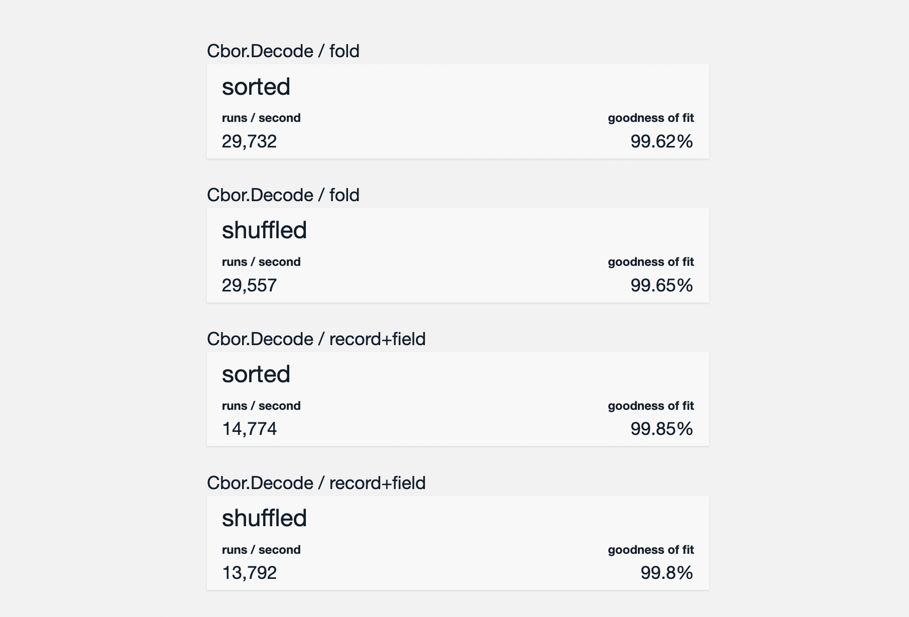

# Benchmarks

These benchmarks exist mainly for the sake of comparing the decoding of large records using the `record` + `field` API vs the `fold` API. The former is more elegant while the latter is more efficient and can be tedious to write. Both work in the with unordered records. The "sorted" bench illustrate the case where fields in a record are provided in order (which is the _usual_ case) and is slightly optimized for the `record` + `field` API.

